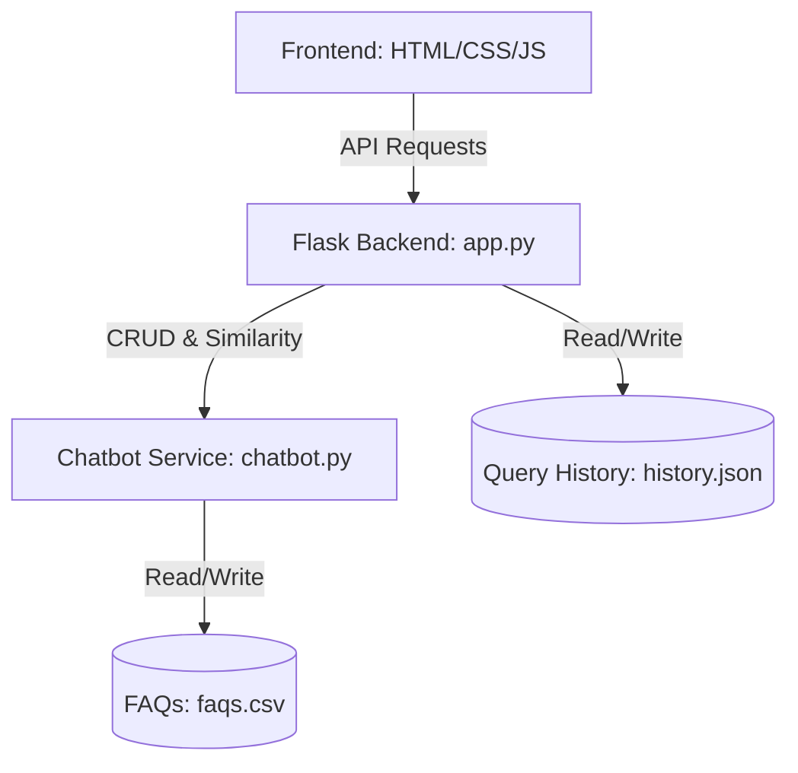

# Implementation Plan - Chatbot Dashboard with Chat & Admin View

We will build a custom Flask web application with a premium, responsive dashboard containing a Chat interface and an Admin view. The Admin view will support company switching, viewing confidence scores, listing/managing FAQs (CRUD), and reviewing query history analytics.

## Proposed System Architecture
The application will have a Python Flask backend and a modern HTML/CSS/JS frontend (Single Page Application style with tabbed/sidebar navigation) styled using Vanilla CSS.

## User Review Required

> [!IMPORTANT]
> The chatbot logic requires installing `Flask` in the virtual environment. We will execute `.\venv\Scripts\pip install flask` (and `flask-cors` if needed for api flexibility) to add Flask to the environment.

## Open Questions
No major open questions. We will use the existing `faqs.csv` file structure and write the chatbot logic in a clean, modular way, saving query history to a local JSON file (`history.json`) for persistence across server restarts.

---

## Proposed Changes

### Backend Component

#### [NEW] [chatbot.py](file:///c:/Users/Deshan/Documents/Cloud99x_Projects/Test_Implementation_1/chatbot.py)
We will refactor the chatbot code from [main.py](file:///c:/Users/Deshan/Documents/Cloud99x_Projects/Test_Implementation_1/main.py) into a clean, importable class `ChatbotService` inside `chatbot.py`. It will handle:
- Loading FAQs from `faqs.csv`.
- Vectorizing FAQs per company.
- Finding the best match with cosine similarity and returning:
  - Best matched question
  - Best matched answer
  - Confidence score (float)
- Adding, editing, and deleting FAQs in the CSV and rebuilding the vectors dynamically.

#### [NEW] [app.py](file:///c:/Users/Deshan/Documents/Cloud99x_Projects/Test_Implementation_1/app.py)
We will create a Flask server (`app.py`) with the following API endpoints:
- `GET /api/companies`: Get list of unique companies from `faqs.csv`.
- `GET /api/faqs`: Get all FAQs or filtered by company.
- `POST /api/faqs`: Add a new FAQ (requires company, question, answer).
- `PUT /api/faqs/<int:index>`: Update an FAQ.
- `DELETE /api/faqs/<int:index>`: Delete an FAQ.
- `POST /api/chat`: Send a user query. Requires `company` and `question`. Returns the bot's response, matched question, and confidence score. This will also log the query to `history.json`.
- `GET /api/history`: Get historical queries with timestamps, selected company, user question, matched question, and confidence score.
- `GET /`: Serve the frontend application.

### Frontend Component

#### [NEW] [templates/index.html](file:///c:/Users/Deshan/Documents/Cloud99x_Projects/Test_Implementation_1/templates/index.html)
We will create a single HTML page serving as the dashboard container. It will include:
- A sidebar navigation menu:
  - Header with Logo/Title
  - "Chat Interface" navigation item
  - "Admin Dashboard" navigation item
  - Active Company Selector (dropdown/switch in sidebar/header)
- A main content area split into two primary view panels:
  - **Chat Panel**: A messaging UI with an active conversation flow, company selection context, standard quick-question buttons, and typing animations.
  - **Admin Panel**:
    - **KPI Metrics Cards**: Total Chats, Avg Confidence Score (with gauge or status color), Low Confidence Count, Total FAQs.
    - **FAQ Manager Tab**: Interactive search, table listing FAQs, and forms for adding/editing FAQs.
    - **Query Log Tab**: A detailed history table showing recent queries, exact confidence scores, status badges (high/low confidence), and timestamps.

#### [NEW] [static/css/style.css](file:///c:/Users/Deshan/Documents/Cloud99x_Projects/Test_Implementation_1/static/css/style.css)
A custom style sheet implementing a premium dashboard design using:
- Modern Typography: Google Font 'Outfit' and 'Inter'.
- Premium Color System: Dark mode / Slate grey base with deep indigo and vibrant teal accents.
- Modern layout: Sidebar-based fluid grid layout, Glassmorphic cards (`backdrop-filter`, subtle borders, shadows).
- Responsive design: Media queries for clean rendering on smaller screens.
- Micro-animations: Smooth transitions on button hovers, input focuses, and view switches.

#### [NEW] [static/js/app.js](file:///c:/Users/Deshan/Documents/Cloud99x_Projects/Test_Implementation_1/static/js/app.js)
State management and API interactions using vanilla JS:
- Routing: Show/Hide views (Chat vs. Admin) via tabs.
- API wrapper (`fetch` calls) for listing companies, querying chatbot, fetching/updating FAQs, and retrieving analytics log.
- Local state management: Current active company, current views, active filters.
- Interactive charts or gauges (simple CSS-based gauges or progress bars for confidence scores and average metrics).

---

## Verification Plan

### Automated Tests
- We will verify API endpoints using a python script or `curl`/`Invoke-RestMethod` calls.

### Manual Verification
- Launch the Flask server using `python app.py`.
- Open the application in the browser.
- **Chat View verification**:
  - Switch companies and check if chat responses correspond to the selected company's knowledge base.
  - Ask queries and check if chat bubbles render correctly.
  - Verify that the confidence score is captured.
- **Admin View verification**:
  - Verify metrics update when questions are asked.
  - Verify that adding a new FAQ dynamically adds it to the FAQ list and chatbot's response pool.
  - Verify that editing or deleting an FAQ is immediately reflected.
  - Verify that query logs correctly show the user questions, matched answers, and confidence scores.
